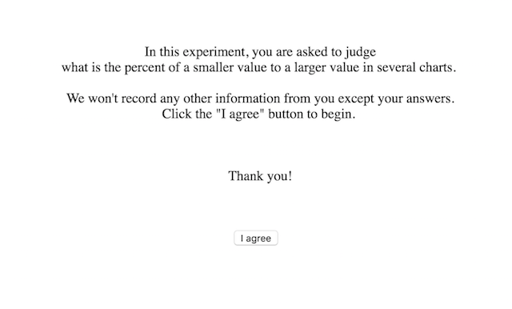

Assignment 4 - Replicating a Classic Experiment  

## Team
- Zheng Nie (nzholmes)

## [Project Link](https://nzholmes.github.io/04-Experiment/index.html)

## Experiment description

To convey same piece of information, there are various types of data visualizations to choose. But their effects differ. Thus, I replicated the classic (Cleveland & McGill, 1984) study with the hypothesis that the bar chart is more effective than stacked bar chart and bubble chart. I made these three visualizations: randomly generating 10 values and selecting two of them at random with black dots. Participants were asked to provide what percent they thought the smaller value is to larger value. I invited my friends to "play this game", received 38 responses and stored them in my own computer. The detailed process and analyses are presented as below.

- **Instructions at the beginning of the experiment**

 
 
- **Example of the bar chart with two randomly marked bars**

 
 
- **Example of the stacked bar chart with two randomly marked layers**

 
 
- **Example of the bubble chart with two randomly marked bubbles**

 
 
- **Collected data and distributions of error for three charts**

 All of data is saved in the csv file named data.csv.
 
 * __Collected data__
 
 
 
 * __The distribution of error for all charts__
 
 
 * __The distribution of error for bar chart__
 
 
 * __The distribution of error for stacked bar chart__
 
 
 * __The distribution of error for bubble chart__
 
 
- **Analyses**

  38 respondents completed the task and the number of responses for these three visualizations is 228. The measure is the "cm-error" in the classic study paper, which take the form `log2(|judged percent - true percent| + 1/8)`. When participants made accurate guesses, judged percent is equal to true percent, causing the measure to be `-3`. This is against normal convention. So in such cases, I set the measure as `0`. The 95% confidence interval for average error was obtained by bootstrap sampling with replacement 10000 times. 

 
 
 

- **Conclusion**

  The result is in line with Cleveland and McGill’s results: the bar chart comes to the top, with stacked bar chart and bubble chart respectively in the second and third place. But probably due to the small number of respondents and other reasons, the error is greater than that in the Cleveland and McGill’s study and extensions of the experiment.

## Technical achievements

- To send responses to my own computer, I made use of **AJAX** of JQuery. I never did this before and met some challenges at the start. 

- To store data in my own computer, I used python DJango web framework because python is well-known in its data processing and analyses and I am familiar with its packages such as `pandas` and `numpy`. But building my own computer as a server was not as easy as expected. *Forward*, a product that makes localhost shareable, enables my localhost to be accessed from external sources. In order to receive responses from various origins, I installed `django-cors-headers` app. Can you believe all of these are new to me before this assignment?

## Design achievements

The main achievement in this assignment is **Latin Square design** mentioned in the assignment requirement. To ensure that all trials are counterbalanced, I implemented a function to generate a latin square to shuffle the order of each chart.

